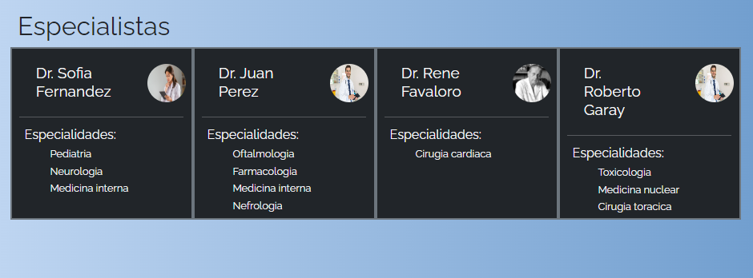
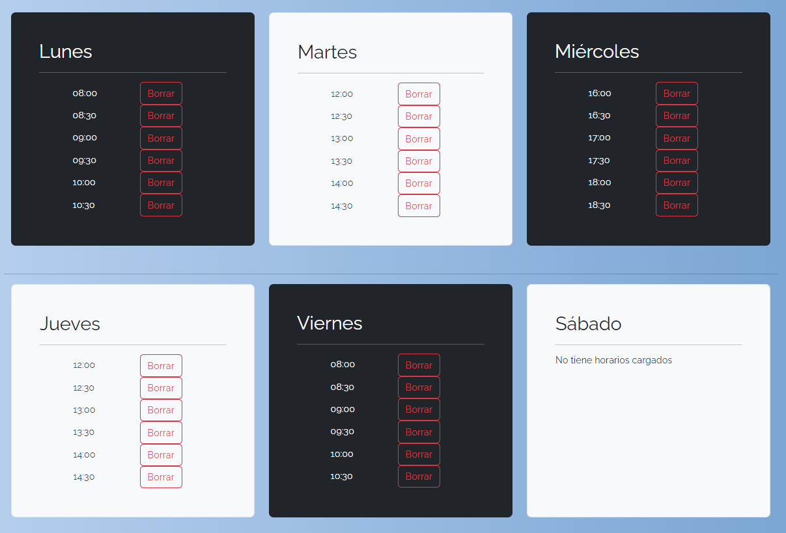

# **Trabajo Practico Laboratorio IV**

Este trabajo fue creado con [Angular CLI](https://github.com/angular/angular-cli) version 16.2.1.

## Hosting

Puedes visitar la pagina [Link del proyecto](https://tpf-labo4.web.app/)

## **Resumen**

Al visitar la [url](https://tpf-labo4.web.app/) se presenta con una ventana de bienvenida **Welcome**.

En el cual se podran hacer tres acciones:

- **Registrar un Paciente**
- **Registrar un Especialista**
- **Entrar a la pagina** _(Login)_

### **Registrar un Paciente**

Se accedera a un formulario donde el usuario debera cargar los datos requieridos para registrarse:
_(nombre, apellido, DNI, edad, email, contraseña, foto de perfil, foto del dni y seleccionar una obra social de la tabla izquierda)_

### **Registrar un Especialista**

Se accedera a un formulario donde el usuario debera cargar los datos requieridos para registrarse:
_(nombre, apellido, DNI, edad, email, contraseña, foto de perfil y seleccionar las especialidades de la tabla izquierda)_

### **Log In**

Con esta ventana el usuario podra logear su cuenta, siempre igual su email sea verificado y en el caso de ser un especialsita habilitado por un administrador. Tambien en la esquina inferior derecha tiene una lista desplegrable de usuarios disponibles para un acceso rapido.

## **Como Paciente**

### **Solicitar Turno**

Al principio debera elegir uno de los siguientes filtros _(Especialidades o Especialsitas)_

#### Especialidades

Podra ver un listado de todas las especialidades que trabaja la clinica.

#### Especialistas

Podra ver un listado de cada especialista que trabaja la clinica.

#### Seleccion de Turno

Con los anteriores filtros podra seleccionar un turno dentro de los
próximos 15 días al horario que desee, siempre y cuando ese turno no este reservado (si lo esta lo veria en gris sin poder seleccionarlo)

### **Mis Turnos**

El paciente podra ver su historial de turnos y realizar las acciones correspondientes

## **Como Especialista**

### **Mi Perfil**

El especialista podra ver su informacion personal y su jornada laboral

#### **Mis Horarios**

Podra agregar horarios nuevos.

Como tambien editarlos.

### **Mis Turnos**

El especialista podra ver su historial de turnos y realizar las acciones correspondientes

## **Como Admin**

### **Adminstrar Pacientes**

El administrador podra ver la informacion de todos los pacientes.

### **Adminstrar Especialistas**

El administrador podra ver la informacion de todos los especialistas y habilitarlos.

### **Adminstrar Admins**

El administrador podra crear usuarios de administrador

### **Turnos**

El administrador podra ver la informacion de todos los turnos
Al principio debera elegir uno de los siguientes filtros _(Todos, Especialidades o Especialsitas)_

